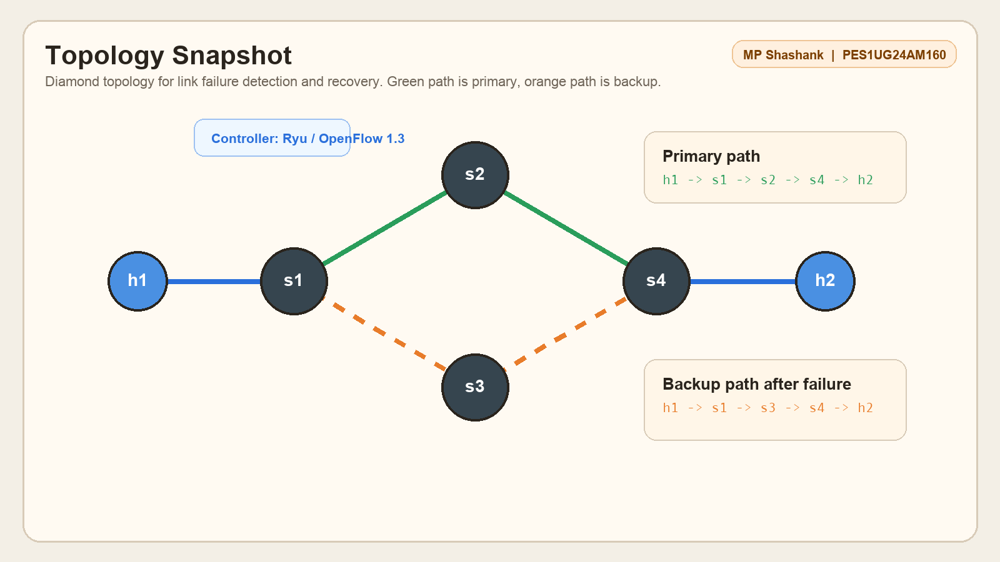
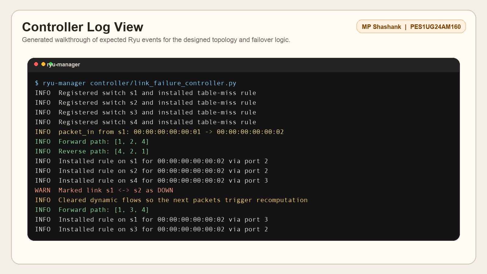
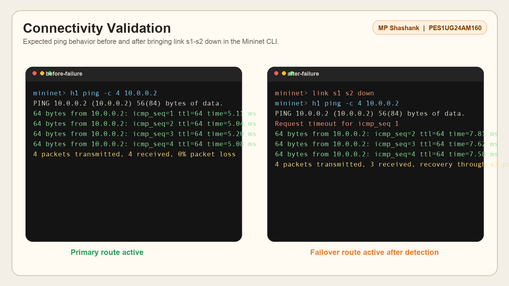
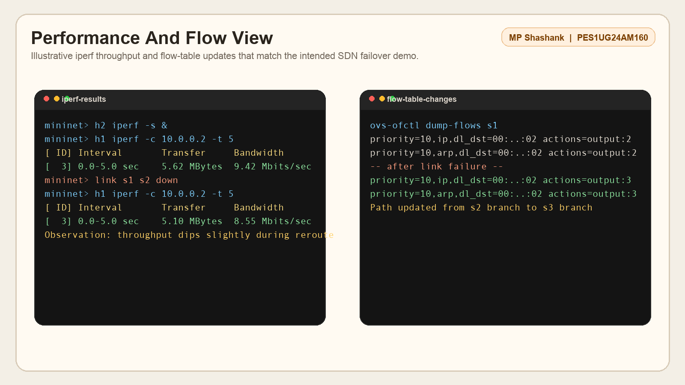

# SDN Mininet Orange Problem: Link Failure Detection and Recovery

## Student Details

- Name: MP Shashank
- SRN: PES1UG24AM160
- Project Type: Individual Submission

## Problem Statement

This project implements an SDN-based link failure detection and recovery workflow using Mininet and a Ryu controller. The controller monitors switch events, detects link failures through OpenFlow port status updates, recomputes a valid path, and installs fresh flow rules so end-to-end connectivity is restored through an alternate route.

## Project Objective

The implementation demonstrates:

- Controller and switch interaction using OpenFlow 1.3
- Explicit match-action flow rule installation
- Packet-in handling and path computation
- Dynamic route update after link failure
- Validation using `ping` and `iperf`

## Topology

The Mininet topology is a diamond network:

- `h1` connected to `s1`
- `s1` connected to `s2`
- `s1` connected to `s3`
- `s2` connected to `s4`
- `s3` connected to `s4`
- `h2` connected to `s4`

Primary path:

- `h1 -> s1 -> s2 -> s4 -> h2`

Backup path after a failure on `s1-s2` or `s2-s4`:

- `h1 -> s1 -> s3 -> s4 -> h2`

## Repository Structure

```text
sdn-link-failure-detection-recovery/
├── controller/
│   └── link_failure_controller.py
├── topology/
│   └── orange_topology.py
├── scripts/
│   └── run_demo.sh
├── docs/
│   └── proof/
│       └── README.md
├── .gitignore
├── README.md
├── STUDENT_INFO.md
└── requirements.txt
```

## Requirements

- Python 3
- Mininet
- Ryu controller
- Open vSwitch
- `iperf` or `iperf3`

Install Python dependencies:

```bash
pip install -r requirements.txt
```

## How To Run

Start the Ryu controller:

```bash
ryu-manager controller/link_failure_controller.py
```

In another terminal, start the Mininet topology:

```bash
sudo python3 topology/orange_topology.py
```

## Suggested Validation Steps

Once the Mininet CLI opens:

1. Check connectivity:

```bash
pingall
```

2. Observe the active route:

```bash
h1 ping -c 4 10.0.0.2
```

3. Start an `iperf` server:

```bash
h2 iperf -s &
```

4. Run throughput from `h1`:

```bash
h1 iperf -c 10.0.0.2 -t 5
```

5. Trigger a link failure:

```bash
link s1 s2 down
```

6. Re-run the traffic test to confirm rerouting:

```bash
h1 ping -c 4 10.0.0.2
h1 iperf -c 10.0.0.2 -t 5
```

7. Restore the failed link if needed:

```bash
link s1 s2 up
```

## Expected Output

- On the first packet, the controller receives `packet_in`
- The controller installs explicit flows along the computed path
- When a link goes down, the controller marks that edge inactive
- Existing path flows are cleared
- New packets trigger recomputation through the backup path
- `ping` should recover and `iperf` should continue on the alternate route

## Test Scenarios

### Scenario 1: Normal Connectivity

- All links remain up
- Traffic uses the preferred path through `s2`
- `ping` succeeds and `iperf` reports stable throughput

### Scenario 2: Link Failure Recovery

- Bring down `s1-s2` or `s2-s4`
- The controller detects the failure via port status update
- Traffic is rerouted through `s3`
- Connectivity is restored without changing the host configuration

## Proof Of Execution

The repository now includes generated walkthrough visuals under `docs/proof/` so the project page is presentation-ready.

Note: these are generated documentation screenshots based on the intended project behavior because Mininet and Ryu were not available on the current machine. If your evaluator wants live lab captures, replace them after running the project in a Linux SDN environment.

### 1. Topology View



### 2. Controller Log View



### 3. Ping Recovery Validation



### 4. Performance And Flow Changes



## References

- Mininet Documentation: <http://mininet.org/>
- Ryu Documentation: <https://ryu.readthedocs.io/>
- OpenFlow Switch Specification

All external references used for the final report/demo should be cited clearly.
